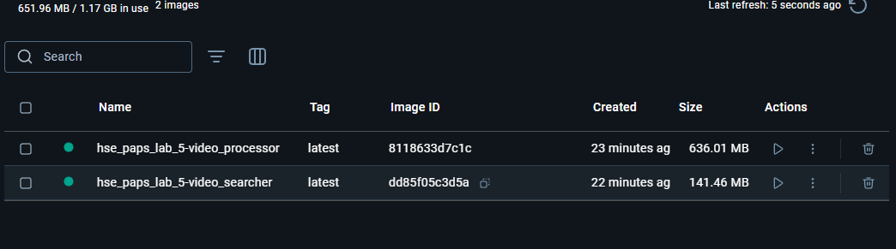

# Отчет о выполнении лабораторной работы №5: Реализация архитектуры на основе сервисов (микросервисной архитектуры)

## Цель работы

Целью лабораторной работы было разработать систему на основе микросервисной архитектуры с использованием контейнеризации (Docker) для сервисов, которые взаимодействуют между собой. Также было необходимо настроить процесс непрерывной интеграции и развертывания (CI/CD) для автоматизации сборки, тестирования и развертывания приложения.

## Выполненные шаги

### 1. Проектирование микросервисной архитектуры
- Разработаны два основных сервиса:
  - **Video Processor** — сервис для распознавания объектов на видео.
  - **Video Searcher** — сервис для поиска видео с определенными объектами.
- Для взаимодействия между сервисами использовалась микросервисная архитектура, где каждый сервис работает в своем отдельном Docker-контейнере.

### 2. Реализация сервисов с использованием Docker
- Созданы два Dockerfile для каждого сервиса:
  - В Dockerfile для **video_processor** добавлена установка всех необходимых зависимостей, таких как OpenCV, Flask и `pytest` для тестирования.
  - В Dockerfile для **video_searcher** добавлена установка зависимостей для Flask, Requests и `pytest`.
- Установлены все необходимые библиотеки для работы сервисов, включая **`requests`**, который использовался в тестах.

### 3. Настройка Docker Compose
- Создан файл **`docker-compose.yml`**, который объединяет два сервиса и позволяет запускать их в одном контейнеризированном окружении.
- В Docker Compose настроены имена сервисов для правильного взаимодействия между ними. Например, **video_processor** доступен как сервис для **video_searcher** по имени **`video_processor:5000`**.

### 4. Реализация тестов
- Для каждого сервиса были написаны интеграционные тесты с использованием **`pytest`**.
- Тесты проверяли корректность работы API, а именно, что каждый сервис правильно обрабатывает запросы и возвращает ожидаемые результаты.
- Для выполнения тестов были использованы Docker-контейнеры с флагом **`-T`**, чтобы отключить TTY в CI/CD средах.

### 5. Настройка непрерывной интеграции (CI)
- Использован **GitHub Actions** для автоматизации процесса сборки, тестирования и развертывания.
- Настроен файл **`ci.yml`**, который:
  - Клонирует репозиторий.
  - Собирает Docker-образы для обоих сервисов.
  - Запускает тесты в контейнерах.
- Вся работа с Docker была автоматизирована с использованием **docker/build-push-action** и **docker-compose**.